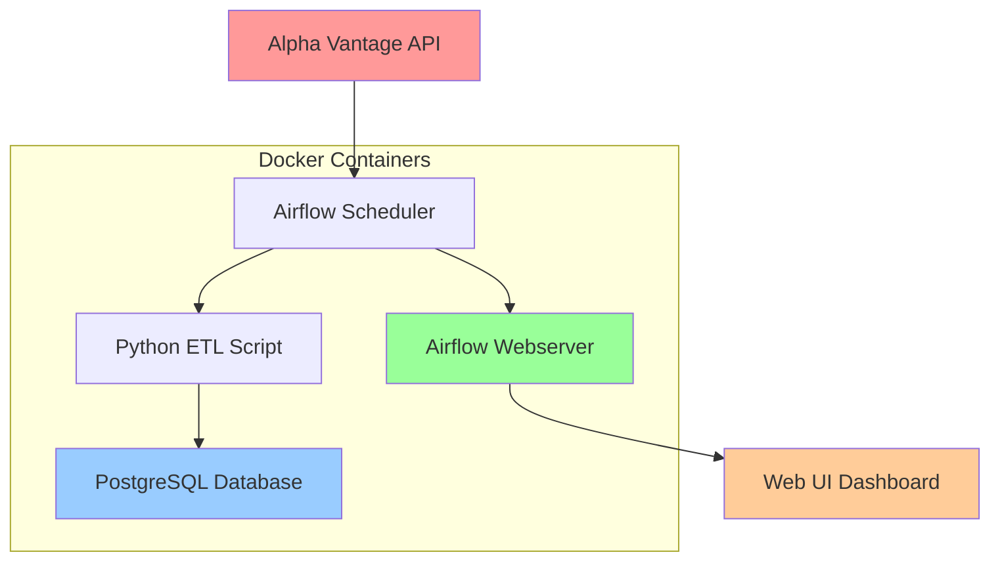

<div align="center">

# 📈 Docker Airflow Stock Pipeline

*A robust, automated stock data pipeline using Apache Airflow, PostgreSQL, and Alpha Vantage API*

[](LICENSE)
[](https://airflow.apache.org/)
[](https://www.postgresql.org/)
[](https://www.docker.com/)
[](https://www.python.org/)

[🚀 Quick Start](#-quick-start) • [📋 Features](#-features) • [🏗️ Architecture](#️-architecture) • [📊 Monitoring](#-monitoring) • [🔧 Configuration](#-configuration)

</div>

---


## 📋 Features

- **🔄 Automated Data Collection**: Fetches real-time stock data from Alpha Vantage API every hour
- **📊 Data Storage**: Stores structured stock data in PostgreSQL with proper indexing
- **🛠️ Orchestration**: Uses Apache Airflow for workflow management and scheduling
- **🐳 Containerized**: Fully containerized with Docker Compose for easy deployment
- **🔍 Monitoring**: Built-in Airflow web UI for pipeline monitoring and debugging
- **⚡ Scalable**: Configurable for multiple stock symbols and intervals
- **🔐 Secure**: Environment-based configuration management

## 🏗️ Architecture



### 📦 Components

| Component | Purpose | Port |
|-----------|---------|------|
| **Airflow Webserver** | Web UI for monitoring pipelines | `:8080` |
| **Airflow Scheduler** | Orchestrates and schedules DAGs | - |
| **PostgreSQL** | Data storage and Airflow metadata | `:5432` |
| **ETL Scripts** | Data fetching and processing logic | - |

## 🚀 Quick Start

### Prerequisites

- Docker & Docker Compose installed
- Alpha Vantage API key ([Get free key](https://www.alphavantage.co/support/#api-key))

### 1. Clone the Repository

```bash
git clone <repository-url>
cd Docker-Airflow-Stock-pipeline_2
```

### 2. Configure Environment

Copy and edit the environment file:

```bash
# Update the ALPHA_VANTAGE_API_KEY in .env file
vim .env
```

### 3. Launch the Pipeline

```bash
# Start all services
docker-compose up -d

# View logs (optional)
docker-compose logs -f
```

### 4. Access Airflow Dashboard

Open your browser and navigate to: **http://localhost:8080**

**Default Credentials:**
- Username: `admin`
- Password: `admin`

### 5. Monitor Your Pipeline

1. Navigate to the **DAGs** page
2. Find `stock_price_pipeline` 
3. Toggle it **ON** to start automated runs
4. View execution history and logs

## 📊 Monitoring

### Airflow Web Interface

The Airflow web UI provides comprehensive monitoring capabilities:

- **📈 DAG Overview**: Visual pipeline representation
- **📋 Task Logs**: Detailed execution logs for debugging
- **⏰ Schedule History**: Track successful and failed runs
- **🔄 Manual Triggers**: Run pipelines on-demand

### Database Monitoring

Connect to PostgreSQL to query your data:

```bash
# Connect to database
docker exec -it postgres psql -U airflow -d airflow

# Query stock data
SELECT symbol, price, timestamp 
FROM stock_prices 
ORDER BY timestamp DESC 
LIMIT 10;
```

## 🗂️ Project Structure

```
├── 📁 airflow/
│   ├── 📁 dags/
│   │   └── 📄 stock_dag.py          # Main DAG definition
│   ├── 📁 scripts/
│   │   ├── 📄 __init__.py
│   │   └── 📄 fetch_and_store.py    # ETL logic
│   └── 📄 requirements.txt          # Python dependencies
├── 📁 db/
│   └── 📄 init.sql                  # Database schema
├── 📁 .vscode/
│   └── 📄 settings.json             # VS Code configuration
├── 📄 docker-compose.yml            # Container orchestration
├── 📄 .env                          # Environment variables
└── 📄 README.md                     # This file
```

## 🔧 Configuration

### Stock Symbol Configuration

Update the stock symbol in [.env](.env):

```bash
STOCK_SYMBOL=AAPL  # Change to any valid stock symbol
```

### Schedule Configuration

Modify the schedule in [`stock_dag.py`](airflow/dags/stock_dag.py):

```python
schedule_interval="@hourly"  # Options: @daily, @hourly, cron expressions
```

### Database Schema

The pipeline creates the following table structure:

```sql
CREATE TABLE stock_prices (
    id SERIAL PRIMARY KEY,
    symbol VARCHAR(10) NOT NULL,
    price NUMERIC(18, 4),      -- Current/Close price
    open NUMERIC(18, 4),       -- Opening price
    high NUMERIC(18, 4),       -- Highest price
    low NUMERIC(18, 4),        -- Lowest price
    volume BIGINT,             -- Trading volume
    timestamp TIMESTAMP NOT NULL,
    created_at TIMESTAMP DEFAULT NOW()
);
```

## 🔍 API Integration

### Alpha Vantage API

The pipeline uses Alpha Vantage's **TIME_SERIES_INTRADAY** function:

- **Interval**: 5-minute data points
- **Rate Limit**: 5 requests per minute (free tier)
- **Data Format**: JSON response with OHLCV data

### Sample API Response Structure

```json
{
  "Time Series (5min)": {
    "2024-01-15 16:00:00": {
      "1. open": "185.2000",
      "2. high": "185.5000", 
      "3. low": "184.8000",
      "4. close": "185.1000",
      "5. volume": "125000"
    }
  }
}
```

## 🛠️ Development

### Adding New Stock Symbols

1. **Multi-symbol support**: Modify [`fetch_and_store.py`](airflow/scripts/fetch_and_store.py) to handle multiple symbols
2. **Update environment**: Add symbols to [.env](.env) file
3. **Database indexing**: Add indexes for better query performance

### Custom Data Sources

To integrate additional data sources:

1. Create new scripts in [`airflow/scripts/`](airflow/scripts/)
2. Add new tasks to [`stock_dag.py`](airflow/dags/stock_dag.py)
3. Update dependencies in [`requirements.txt`](airflow/requirements.txt)

### Local Development

```bash
# Install dependencies locally
pip install -r airflow/requirements.txt

# Run tests
python -m pytest airflow/scripts/

# Format code
black airflow/scripts/
```

## 🐳 Docker Commands

### Useful Docker Commands

```bash
# View running containers
docker-compose ps

# View logs for specific service
docker-compose logs airflow-webserver

# Restart services
docker-compose restart

# Stop all services
docker-compose down

# Rebuild containers
docker-compose up --build

# Access PostgreSQL CLI
docker exec -it postgres psql -U airflow -d airflow

# Access Airflow container
docker exec -it airflow-webserver bash
```

## 📈 Usage Examples

### Query Recent Stock Data

```sql
-- Get latest 24 hours of data
SELECT symbol, price, open, high, low, volume, timestamp
FROM stock_prices 
WHERE timestamp >= NOW() - INTERVAL '24 hours'
ORDER BY timestamp DESC;

-- Calculate daily averages
SELECT 
    symbol,
    DATE(timestamp) as date,
    AVG(price) as avg_price,
    MAX(high) as daily_high,
    MIN(low) as daily_low,
    SUM(volume) as total_volume
FROM stock_prices 
GROUP BY symbol, DATE(timestamp)
ORDER BY date DESC;
```

### Airflow CLI Commands

```bash
# List all DAGs
docker exec airflow-scheduler airflow dags list

# Trigger DAG manually
docker exec airflow-scheduler airflow dags trigger stock_price_pipeline

# View task logs
docker exec airflow-scheduler airflow tasks log stock_price_pipeline fetch_and_store_stock_data 2024-01-15
```

## 🔒 Security Considerations

- **API Keys**: Store API keys securely in environment variables
- **Database Access**: Use strong passwords and limit database access
- **Network Security**: Configure firewall rules for production deployment
- **Container Security**: Regularly update base images and dependencies

## 🚨 Troubleshooting

### Common Issues

**🔴 Airflow Web UI not accessible**
```bash
# Check if containers are running
docker-compose ps

# Restart webserver
docker-compose restart airflow-webserver
```

**🔴 Database connection errors**
```bash
# Verify PostgreSQL is running
docker-compose logs postgres

# Check environment variables
docker exec airflow-webserver env | grep POSTGRES
```

**🔴 API rate limits exceeded**
- Check Alpha Vantage API usage limits
- Consider upgrading to premium plan
- Implement exponential backoff in retry logic

### Log Analysis

```bash
# View all logs
docker-compose logs

# Follow specific service logs
docker-compose logs -f airflow-scheduler

# View Airflow task logs via web UI
# Navigate to: localhost:8080 → DAGs → stock_price_pipeline → Graph → Click task → View Log
```

## 🤝 Contributing

1. **Fork** the repository
2. **Create** a feature branch (`git checkout -b feature/amazing-feature`)
3. **Commit** your changes (`git commit -m 'Add amazing feature'`)
4. **Push** to the branch (`git push origin feature/amazing-feature`)
5. **Open** a Pull Request

## 📄 License

This project is licensed under the **MIT License** - see the [LICENSE](LICENSE) file for details.

## 🙏 Acknowledgments

- **Apache Airflow** - Workflow orchestration platform
- **Alpha Vantage** - Stock market data API
- **PostgreSQL** - Robust database system
- **Docker** - Containerization platform

---

<div align="center">

**⭐ Star this repository if it helped you!**

[Report Bug](../../issues) • [Request Feature](../../issues) • [Documentation](../../wiki)

Made with ❤️ by [Pranjal Tripathi](https://github.com/pranjal-tripathi)

</div>
